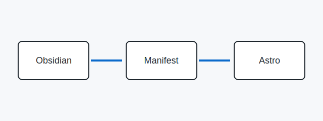

## Why this pipeline exists

This note starts in Obsidian and is exported into the public blog.

It links to [content boundaries](/posts/content-boundaries/) and embeds the same note below.

It also points to [the public allowlist](/posts/content-boundaries/#public-allowlist) and [the allowlist rule](/posts/content-boundaries/#block-allowlist-rule).

<aside class="note-embed"><a href="/posts/content-boundaries/">Read the content boundary note</a></aside>

It also includes a local diagram.

> **Note:** Publishing contract
> Public content is explicit and reproducible.

### What stays private

Private notes stay outside the public build and private index output is never served by the blog.
